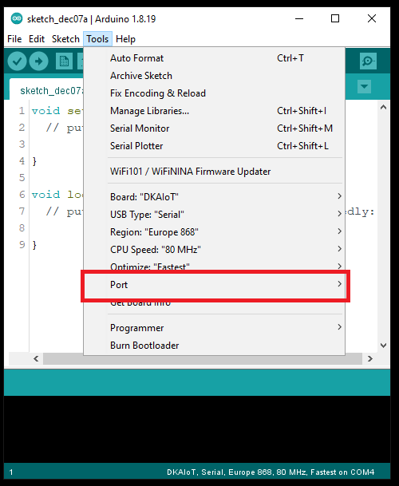
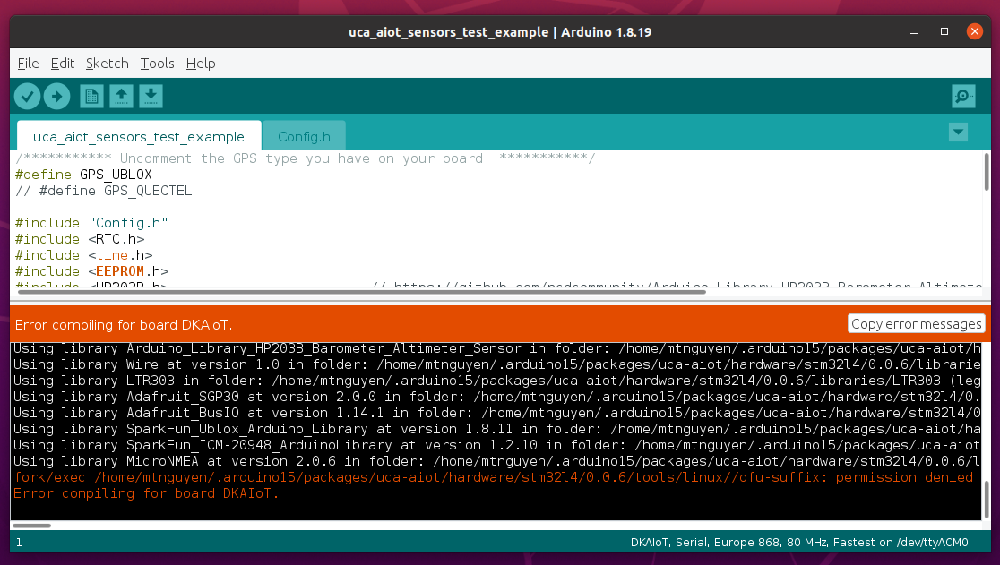

# Frequently Asked Questions / Issues

## Board Bootloader Mode

Normally, whenever you plug the UCA-AIoT boards to your PC, a new Serial COM Port will show up. The ArduinoIDE will automatically trigger the Bootloader Mode of the micro-controller via this COM Port to upload your source code. If your COM Port is not listed (due to Serial disabled mode for power saving or MCU Bootloader missing) or COM Port does not respond (due to last source code include sleeping functions), you need to trigger it manually to upload a new source code.

To manually trigger Bootloader Mode of the MCU, plug the board to your PC via USB and press the following on-board key sequences:
1. Hold the **BOOT** button
2. Press the **RESET** button
3. Release the **RESET** button
4. Release the **BOOT** button

Then, you should see the a new device named "**STM32 BOOTLOADER**" in your **USB Device Manager** (If your PC have the driver installed). Then, upload your need source code.

**Note**: *When you are trigger the Bootloader Mode manually, try to leave the Port option (in **Tools** -> **Port**) unselected. If you cannot deselect the available port, you can close all the instances of ArduinoIDE & reopen it.*



## Linux / MacOS file permission for dfu-utils

If you encounter issues of permission denied on *dfu-prefix*, *dfu-suffix*, *dfu-util*, or *stm32l4-upload* files when compiling/uploading, use this command:
```
chmod ugo+x <filename>
```



Refer to [this issue](https://github.com/FabienFerrero/UCA_AIOT/issues/1) for detailed information.

**Note**: *This bug is fixed from Core version 0.0.7. If you still encounter the same situation with Cores version >= 0.0.7, please create an Issues [here](https://github.com/FabienFerrero/UCA_AIOT/issues/new) to let us know. We would greatly appreciate!*

---

##### :satellite: :space_invader: :beer: Maintained by Prof. F. Ferrero & M.T. :satellite: :space_invader: :beer:
