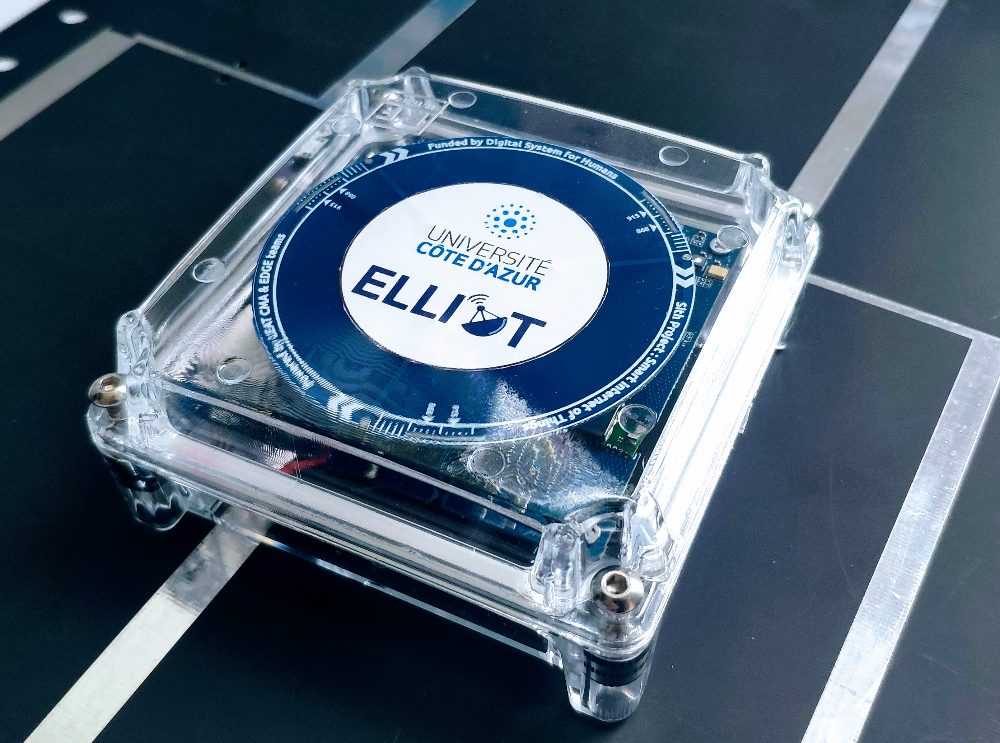
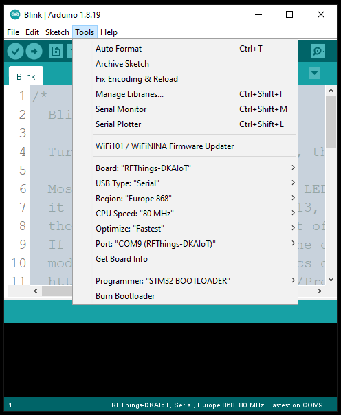
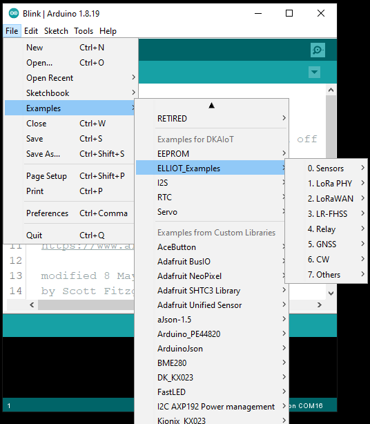

# UCA_AIoT Board (LoRa :green_heart: Space)



## Board Documentations

The **SCHEMATIC** of the board is available in [<b>Schematic/AIoT-001-Jun2621-SCH.pdf</b>](https://github.com/FabienFerrero/UCA_AIOT/blob/main/Schematic/AIoT-001-Jun2621-SCH.pdf)

The instruction of Connecting to External Sensors/Devices is available in [<b>doc/UCA-AIoT-ExternalConnectivity-rev10-Nov2622.pdf</b>](https://github.com/FabienFerrero/UCA_AIOT/blob/main/doc/UCA-AIoT-ExternalConnectivity-rev10-Nov2622.pdf)

## Installing Board Manager

1. [Download and install the Arduino IDE](https://www.arduino.cc/en/Main/Software) (at least version v1.8.13)
2. Start the Arduino IDE
3. Go to Preferences
4. Copy & Add the following JSON URL to your "**Additional Board Manager URL**"
```
https://fabienferrero.github.io/ArduinoBoardManagerJSON/package_uca-dkaiot_index.json
``` 
5. Open the Boards Manager from the **Tools** -> **Board menu** and install "_UCA-DKAIoT by FabienFerrero_"
6. Select your DKAIoT board from the **Tools** -> **Board menu**
7. Config the approriate settings in **Tools** menu, and upload your source code.

*All examples & libraries used in this reposistory are integrated into the Arduino Core. Make sure that the installed core version is latest to be compatible with all examples in this repository!*

**Attention**: *If you have problems in uploading source code to the board (e.g. Uploading failed, COM Port doesn't listed, etc.), refer to *MCU Bootloader Mode* section in [FAQ](./FAQ.md)*.

## OS Specific Setup

### Linux

###### STM32 BOOTLOADER driver setup for UCA-AIoT boards

 1. Go to ~/.arduino15/packages/uca-aiot/hardware/stm32l4/```<VERSION>```/drivers/linux/
 2. sudo cp *.rules /etc/udev/rules.d
 3. reboot

**Attention**: *If you have problems in compiling source code (i.e. Permission denied), refer to *Linux / MacOS file permission for dfu-utils* section in [FAQ](./FAQ.md)*.

### Windows

###### STM32 BOOTLOADER driver setup for UCA-AIoT boards

 1. Download [Zadig](http://zadig.akeo.ie)
 2. Plugin STM32L4 board and toggle the **RESET** button while holding down the **BOOT** button
 3. Let Windows finish searching for drivers
 4. Start ```Zadig```
 5. Select ```Options -> List All Devices```
 6. Select ```STM32 BOOTLOADER``` from the device dropdown
 7. Select ```WinUSB (v6.1.7600.16385)``` as new driver
 8. Click ```Replace Driver```


## Getting Started with Examples

After installing the core, select the DKAIoT board by **Tools** > **Board** > **UCA-DKAIoT Boards** > **DKAIoT**. Examples will be available in **File** > **Examples** > **ELLIOT_Examples** > **...**

Select the board           |  Examples
:-------------------------:|:-------------------------:
      |  

For more information on the examples:

[0. Sensors](examples/0.%20Sensors/)

[1. LoRa PHY](examples/1.%20LoRa%20PHY/)

[2. LoRaWAN](examples/2.%20LoRaWAN/)

[3. LR-FHSS](examples/3.%20LR-FHSS/)

[4. Relay](examples/4.%20Relay/)

[5. GNSS](examples/5.%20GNSS/)

[6. CW (Continuous wave)](examples/6.%20CW/)

[7. Others](examples/7.%20Others/)

## Other Supported Library

The board has been successfully tested with several SX1262 library :

* LoRaWAN Mac protocol: [<b>FabienFerrero/basicmac</b>](https://github.com/FabienFerrero/basicmac) forked from: [<b>LacunaSpace/basicmac</b>](https://github.com/LacunaSpace/basicmac)

**Warning**: Add the following line in the code to make it work.

```
#define ARDUINO_STM32L4_LS200
```

* LoRa Physical layer: [<b>StuartsProjects/SX12XX-LoRa</b>](https://github.com/StuartsProjects/SX12XX-LoRa)

**Warning**: SPI PINS for SX1262 must be defined
```
cfg.nssPin = E22_NSS;
cfg.resetPin = E22_NRST;
cfg.antennaSwitchPin = E22_RXEN;
cfg.busyPin = E22_BUSY;
cfg.dio1Pin = E22_DIO1;
```

---

##### :satellite: :space_invader: :beer: Maintained by Prof. F. Ferrero & M.T. :satellite: :space_invader: :beer:
