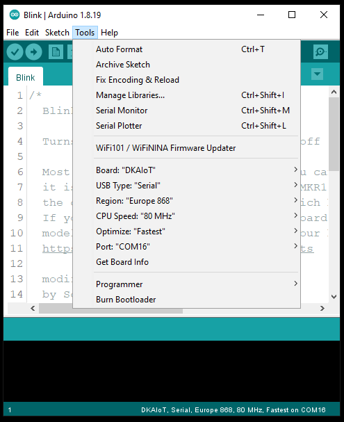

# UCA_AIoT Board (LoRa :green_heart: Space)


## Installing Board Manager

Please install & use the official Arduino Core from **RFThings**: [<b>RFThings/arduino-STM32L4</b>](https://github.com/RFThings/arduino-STM32L4)

*All of examples in this reposistory are integrated into the Arduino Core. Make sure that the installed core version is **0.0.61 (or above)** to be compatible with all examples in this repository!*

## Schematic

The schematic of the board is available in [<b>doc/LS200-007_SCHEMATIC.pdf</b>](https://github.com/FabienFerrero/DKIOT/blob/main/doc/LS200-007_SCHEMATIC.pdf)

## Getting Started with Examples

After installing the core, select the RFThings-DKAIoT board by **Tools** > **Board** > **RFThings STM32L4 Boards** > **RFThings-DKAIoT**. Examples will be available in **File** > **Examples** > **ELLIOT_Examples** > **...**

Select the board           |  Examples
:-------------------------:|:-------------------------:
      |  

For more information on the examples:

[0. Sensors](examples/0.%20Sensors/)

[1. LoRa PHY](examples/1.%20LoRa%20PHY/)

[2. LoRaWAN](examples/2.%20LoRaWAN/)

[3. LR-FHSS](examples/3.%20LR-FHSS/)

[4. Relay](examples/4.%20Relay/)

[5. GNSS](examples/5.%20GNSS/)

[6. CW](examples/6.%20CW/)

[7. Others](examples/7.%20Others/)

## Other Supported Library

The board has been successfully tested with several SX1262 library :

* LoRaWAN Mac protocol: [<b>FabienFerrero/basicmac</b>](https://github.com/FabienFerrero/basicmac) forked from: [<b>LacunaSpace/basicmac</b>](https://github.com/LacunaSpace/basicmac)

**Warning**: Add the following line in the code to make it work.

```
#define ARDUINO_STM32L4_LS200
```

* LoRa Physical layer: [<b>StuartsProjects/SX12XX-LoRa</b>](https://github.com/StuartsProjects/SX12XX-LoRa)

**Warning**: SPI PINS for SX1262 must be defined
```
cfg.nssPin = E22_NSS;
cfg.resetPin = E22_NRST;
cfg.antennaSwitchPin = E22_RXEN;
cfg.busyPin = E22_BUSY;
cfg.dio1Pin = E22_DIO1;
```

##### Maintained by Prof. F. Fererro & mtnguyen
