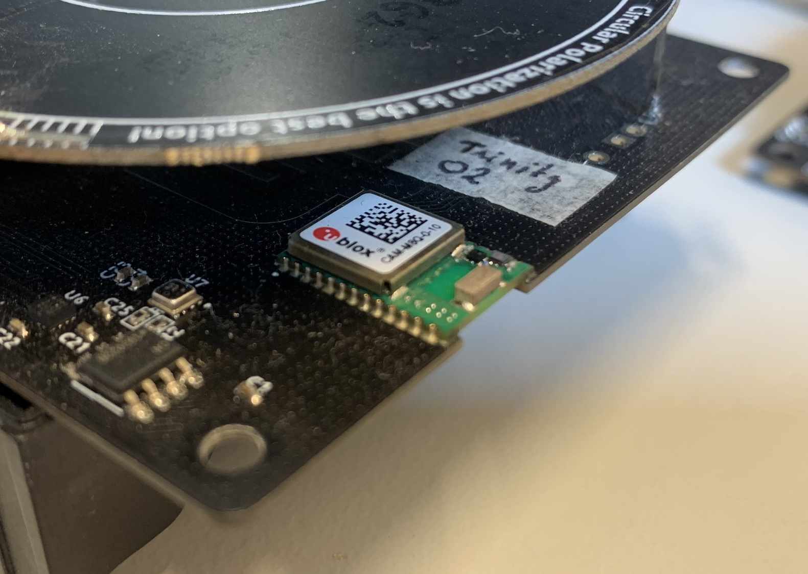
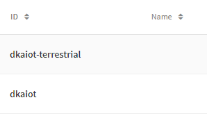
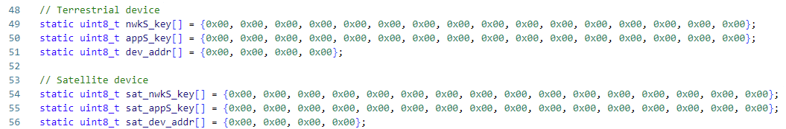
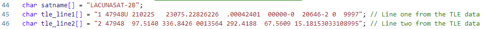
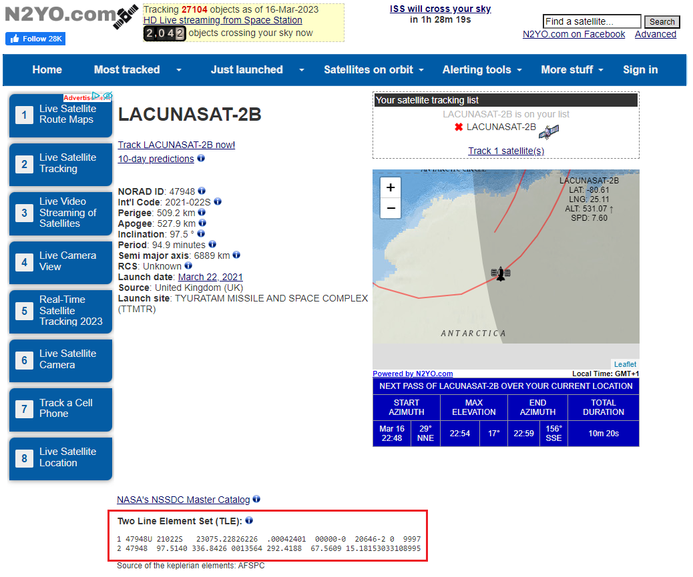
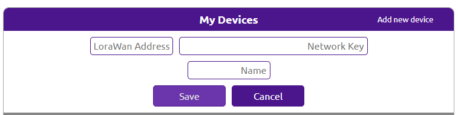
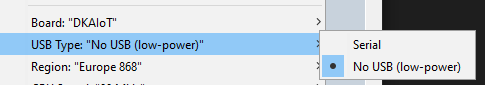
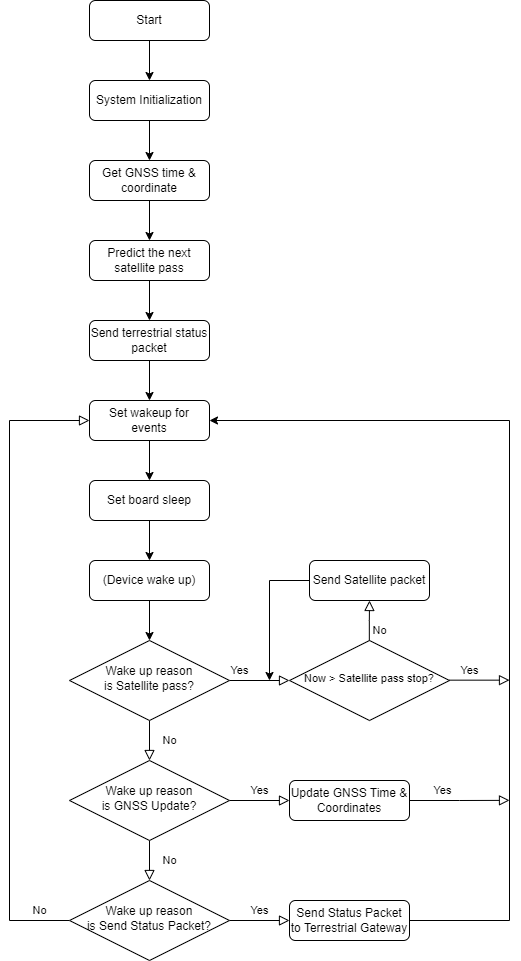
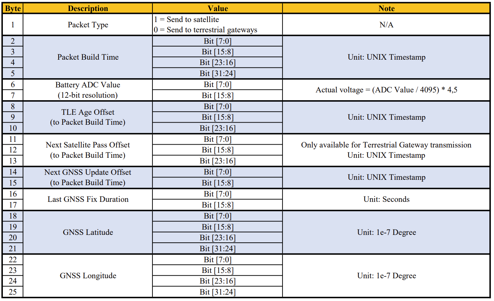

# UCA_AIoT_demo_w_LacunaSpace Example

## Overview
---



This example demonstrates how an UCA-AIOT board can send data to the LS2B satellite from [**Lacuna Space**](https://lacuna.space/). The device will send data to Lacuna Space LS2B satellite when it passes. The data could be retrieved later from The Things Network Console. It's also send a periodic status packets to terrestrial LoRaWAN Gateway.

<u>**FYI**</u>: This source code is aim to test the connectivity between DKAIoT board with Lacuna Space satellites only. It uses a TLE which is not updated while the board runs. Therefore, the prediction of satellite passes will have bigger & bigger error over the time. For practical deploying purpose/scenario, please contact [**Lacuna Space**](https://lacuna.space/) for official firmware or implement the auto TLE update.

## Getting Started
---

- ### **<u>Step 1: The Things Network devices registration</u>**

This demonstration uses [**The Things Network v3**](https://console.cloud.thethings.network/) (TTN) to receive data from UCA-DKAIOT board. It's recommended to use 2 different **ABP devices** on TTN to monitor data from Satellite and from terrestrial LoRaWAN Gateway. Refer to section **Manually registering a device** in this [instruction](https://www.thethingsindustries.com/docs/devices/adding-devices/) from TTN to create your own application and devices.



<u>**Important**</u>: For device that will receive data from satellite, if you are **NOT** using **EU868 Frequency Plan**, add following **Factory Preset Frequencies** for downlink from Satellite in **General Settings** > **Network layer** > **Advanced MAC Settings**:

| **Factory Preset Frequencies** |
|:------------------------------:|
|            868100000           |
|            868300000           |
|            868500000           |
|            867100000           |
|            867300000           |
|            867500000           |
|            867700000           |
|            867900000           |

- ### **<u>Step 2: Modify and upload source code to your UCA-DKAIOT board</u>**


- **<u>Step 2.1: Device Address, NwkSKey & AppSKey</u>**

In the Arduino source code, add the **Device Address**, **NwkSKey** & **AppSKey** information that retrieved from The Things Network in **Step 1** to the source code.



- **<u>Step 2.2: TLE for Lacuna Space LS2B</u>**

For satellite tracking / predicting pass capability, it requires Two Line Element (TLE) of that satellite. Please update the latest TLE in source code from https://www.n2yo.com/satellite/?s=47948 or **Space-Track.org** for more accurate pass prediction.





- **<u>Step 2.3 (OPTIONAL): Other parameters</u>**

There are other parameters in ```#define``` format the source code can help optimizing the performance in different use cases. Refer to the following **Project Configuration / Parameter Description** section for more information.

- ### **<u>Step 3: Declare device to Lacuna Space Dashboard (OPTIONAL)</u>**

In order to check/list your packets from Lacuna Satellite in cased that The Things Network failed/drop it, **Device Address** and **NwkSKey** of the Satellite device must be declared to [Lacuna Dashboard](https://dashboard.lacuna.space/). Go to [Lacuna Dashboard](https://dashboard.lacuna.space/), click **Add new device** and fill in your device information (retrieved in **Step 1**).

If you don't have an Lacuna Dashboard account or need support, please check out [Lacuna Forum](https://forum.lacuna.space/).



## Project Configuration / Parameter Description
---

```
// #define DEBUG_SLEEP
```

Uncomment ```DEBUG_SLEEP``` define will replace sleep functions of the UCA-DKAIOT board with delay. This allow Serial via USB work properly. 

Make sure to comment/delete this option and select **USB Type** as **No USB (low-power)** for field deployment. When debugging with Serial, do it the opposit way.



---

```
#define SAT_PACKET_PERIOD_S (15)                     // 15 seconds
```

```SAT_PACKET_PERIOD_S``` is the time (in **seconds**) between packets send to satellite when it's available (pass).

---

```
#define MIN_PASS_ELAVATION (25)                      // 25 degrees
```

```MIN_PASS_ELAVATION``` is the minimum pass elavation (in **degree**) that the UCA-DKAIOT board will wake up and transmit packets.

---

```
#define TERRESTRIAL_STATUS_PACKET_PERIOD_S (15 * 60) // 15 minutes
```

```TERRESTRIAL_STATUS_PACKET_PERIOD_S``` is the time (in **seconds**) between status packets send to terrestrial LoRaWAN gateway.

---

```
#define GNSS_UPDATE_PERIOD_S (24 * 60 * 60)          // 24 hours
```

```GNSS_UPDATE_PERIOD_S``` is the time (in **seconds**) between two GNSS update for time and coordinates. This is relative time. GNSS update time could be change if it too close to a satellite pass.

---

```
#define GNSS_RESCHEDULE_OFFSET_S (30 * 60)           // 30 minutes
```

```GNSS_RESCHEDULE_OFFSET_S``` is the minumum time (in **seconds**) between a GNSS Update and a satellite pass. GNSS Update Time will be changed to ```Satellite Pass Stop``` + ```GNSS_RESCHEDULE_OFFSET_S``` if it violates the offset.

## Demonstration code behaivour
---



## Packet Format
---

Packets for both terrestrial LoRaWAN transmission and Satellite transmission are in **25-byte** format as following:



The following **Custom Javascript Payload Formatter** can be applied on **The Things Network console** for decoding packets.

```
function decodeUplink(input) {
  var packet_type = (input.bytes[0] === 1) ? 'satellite' : 'terrestrial';
  
  var send_epoch = (input.bytes[1] << 0) | (input.bytes[2] << 8) | (input.bytes[3] << 16) | (input.bytes[4] << 24);
  
  var bat_voltage_adc = (input.bytes[5] << 0) | (input.bytes[6] << 8);
  var battery_vol = bat_voltage_adc * 4.5 / 4095.0;
  
  var tle_age = (input.bytes[7] << 0) | (input.bytes[8] << 8) | (input.bytes[9] << 16);

  var next_pass_epoch = (input.bytes[10] << 0) | (input.bytes[11] << 8) | (input.bytes[12] << 16);
  next_pass_epoch += send_epoch;
  
  var next_gnss_update_epoch = (input.bytes[13] << 0) | (input.bytes[14] << 8);
  next_gnss_update_epoch += send_epoch;
  
  var last_gnss_fix_time = (input.bytes[15] << 0) | (input.bytes[16] << 8);
  
  var gnss_latitude = (input.bytes[17] << 0) | (input.bytes[18] << 8) | (input.bytes[19] << 16) | (input.bytes[20] << 24);
  gnss_latitude /= 1e7;
  var gnss_longitude = (input.bytes[21] << 0) | (input.bytes[22] << 8) | (input.bytes[23] << 16) | (input.bytes[24] << 24);
  gnss_longitude /= 1e7;

  if (input.bytes.length == 25) {
    return {
      data: {
        packet_type: packet_type,
        send_epoch: send_epoch,
        battery_vol: battery_vol,
        tle_age: tle_age,
        next_pass_epoch: next_pass_epoch,
        next_gnss_update_epoch: next_gnss_update_epoch,
        last_gnss_fix_time: last_gnss_fix_time,
        gnss_latitude: gnss_latitude,
        gnss_longitude: gnss_longitude,
        raw_data: input.bytes
      },
      warnings: [],
      errors: []
    };
  }
  else {
    return {
      data: {
        raw_data: input.bytes
      },
      warnings: ["Unrecognized payload"],
      errors: []
    };
  }
}
```


## Credit
---
This demonstration uses [Hopperpop/Sgp4-Library](https://github.com/Hopperpop/Sgp4-Library) for predicting the next pass of the satellite. Consider to give him star if you can.

Goodluck with your space investigation!


##### :satellite: :satellite: :satellite: :satellite: :satellite:
