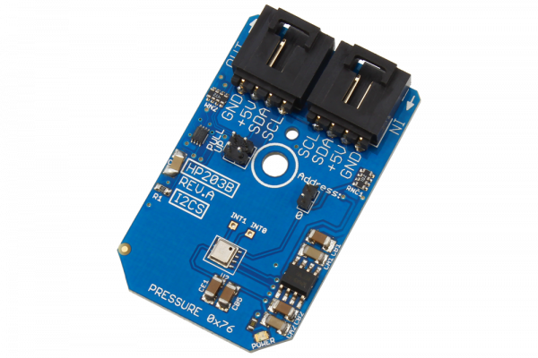

# HP203B

Manufactured by Hope Microelectronics, the HP203B is a high-precision barometer and altimeter that measures the pressure and the temperature by an internal 24-bit ADC and compensates using a patented algorithm.The pressure and temperature outputs are digitized by a high resolution 24-bit ADC. Typical active supply current is 5.3 uA per measurement per second while the ADC output is filtered and decimated by 256. Pressure output can be resolved with output in fractions of a Pascal, and altitude can be resolved in 0.01 meter resolution. The HP203B is specified for operation from -40°C to +85°C.
This Device is available from www.ncd.io 

[SKU: HP203B_I2CS]

(https://store.ncd.io/product/hp203b-precision-barometer-and-altimeter-sensor-i2c-mini-module/)
This Sample code can be used with Arduino.

Hardware needed to interface HP203B sensor with Arduino

1. <a href="https://store.ncd.io/product/i2c-shield-for-arduino-nano/">Arduino Nano</a>

2. <a href="https://store.ncd.io/product/i2c-shield-for-arduino-micro-with-i2c-expansion-port/">Arduino Micro</a>

3. <a href="https://store.ncd.io/product/i2c-shield-for-arduino-uno/">Arduino uno</a>

4. <a href="https://store.ncd.io/product/dual-i2c-shield-for-arduino-due-with-modular-communications-interface/">Arduino Due</a>

5. <a href="https://store.ncd.io/product/hp203b-precision-barometer-and-altimeter-sensor-i2c-mini-module/">HP203B barometer and altimeter Sensor</a>

6. <a href="https://store.ncd.io/product/i%C2%B2c-cable/">I2C Cable</a>

HP203B:

Manufactured by Hope Microelectronics, the HP203B is a high-precision barometer and altimeter that measures the pressure and the temperature by an internal 24-bit ADC and compensates using a patented algorithm.The pressure and temperature outputs are digitized by a high resolution 24-bit ADC. Typical active supply current is 5.3 uA per measurement per second while the ADC output is filtered and decimated by 256. Pressure output can be resolved with output in fractions of a Pascal, and altitude can be resolved in 0.01 meter resolution. The HP203B is specified for operation from -40°C to +85°C.

Applications:

• Mobile altimeter / barometer

• Industrial pressure and temperature sensor system

• Panel computer and weather station equipment, etc.

How to Use the HP203B Arduino Library
The HP203B is very easy to interface as following.

1.Address calling:The following command is used to call the address of HP203B to start the transmission.

            hp.getAddr_HP203B(HP203B_DEFAULT_ADDRESS);          // 0x76
            
2.OSR selection:The OSR command value to intiate the Pressure, Altitude and Temperature Conversions.

            hp.setOSR(OSR_4096);            // OSR=4096
            
3.Output measurement:The following command is used to measure the Pressure, Altitude and Temperature.

            hp.Measure_Sensor();
